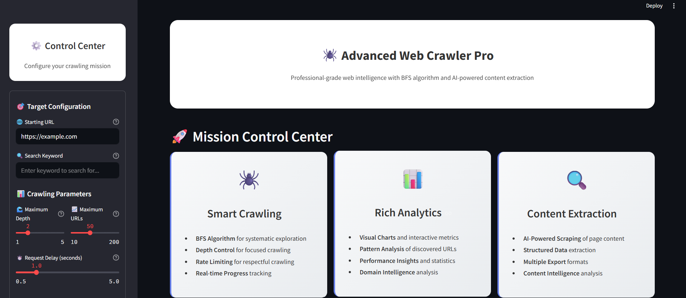
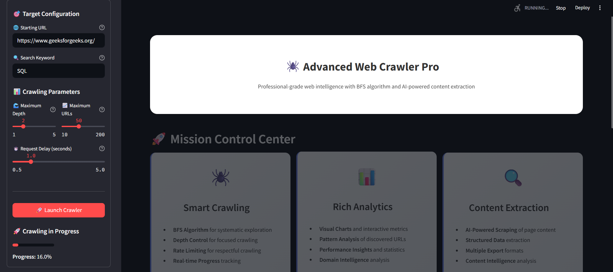
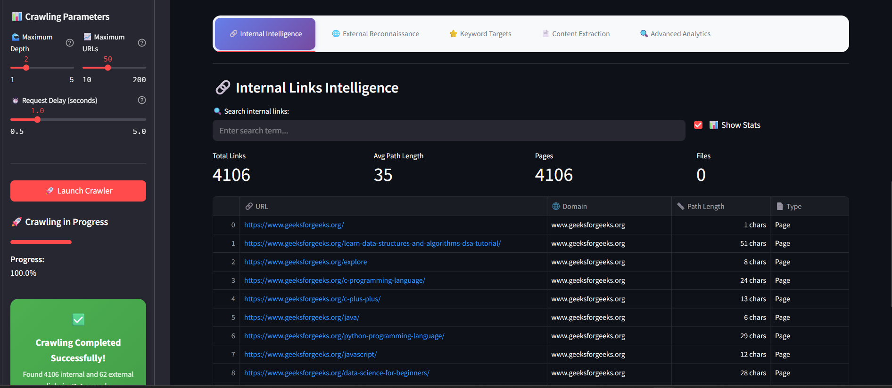

# 🕷️ WEBSPY - Advanced Web Crawler & Scraper

**WEBSPY** is a professional-grade, intelligent Streamlit web app that allows users to:

* 🔗 Perform **BFS-based web crawling**
* 🌐 Classify and analyze **internal & external links**
* 🧠 Extract meaningful content from webpages
* 📊 Visualize crawling analytics
* 🗂 Export scraped data in multiple formats

With a clean UI, keyword filtering, and visual analytics, this tool is ideal for researchers, data analysts, and developers alike.

---

## 📝 Introduction

The project aims to simplify structured **web crawling** and **intelligent content extraction** using modern Python libraries and visual tools. It supports:

* Controlled depth-first crawling
* Real-time crawl monitoring
* Interactive content scraping
* Data visualization and exporting

---

## 🖥️ Example Screenshot





---

## 🛠️ Technologies Used


---

## ⚙️ Features

### 🔍 1. Smart Web Crawler

* Input a **start URL**
* Crawl with **BFS algorithm**
* Control **depth**, **URL limit**, and **delay**
* Track **internal**, **external**, and **keyword-matched** links

---

### 📄 2. Intelligent Content Scraper

* Choose any crawled URL
* Extract:

  * Title, meta description
  * Paragraphs and headings
  * Structured summary
* Export scraped content (JSON/Text)

---

### 📊 3. Crawl Analytics Dashboard

* Real-time progress and speed
* Internal vs external links ratio
* Top domains and URL patterns
* Visual charts using Plotly

---

### 💾 4. Exportable Data

* Export:

  * Internal links
  * External links
  * Suggested URLs
  * Scraped content
* Formats: CSV, JSON, TXT

---

## 🏗️ File Structure

```bash
web-crawler/
├── webspy.py           # Streamlit app with crawler, scraper, and UI
├── assets/                 # Screenshots or media assets (optional)
└── requirements.txt        # All Python dependencies
```

---

## 🚀 Quick Start

### 🔧 Method 1: Run via Streamlit

```bash
streamlit run webspy.py
```

### 🛠️ Method 2: Manual Setup

```bash
# Clone the repository
git clone https://github.com/yourusername/WebSpy.git
cd WebSpy

# Create virtual environment
python -m venv venv
source venv/bin/activate        # Windows: venv\Scripts\activate

# Install dependencies
pip install -r requirements.txt

# Run the app
streamlit run webspy.py
```

---

## 📦 Key Components

| Section           | Description                                 |
| ----------------- | ------------------------------------------- |
| `Queue` class     | Manages crawling queue with size limit      |
| `WebCrawler`      | Main class for crawling, scraping, tracking |
| `main()` function | Streamlit UI controller                     |

---

## 🔧 Configuration

All runtime options are configured via the **sidebar UI**, including:

* Start URL
* Max depth
* Max URLs to crawl
* Request delay
* Keyword for URL filtering

---

## 🛠️ Customization

You can extend or modify:

* Crawler logic → inside `WebCrawler` class
* Scraping rules → in `scrape_content()`
* Charts & visuals → Plotly and Pandas usage
* Export formats → Streamlit’s download widgets

---
